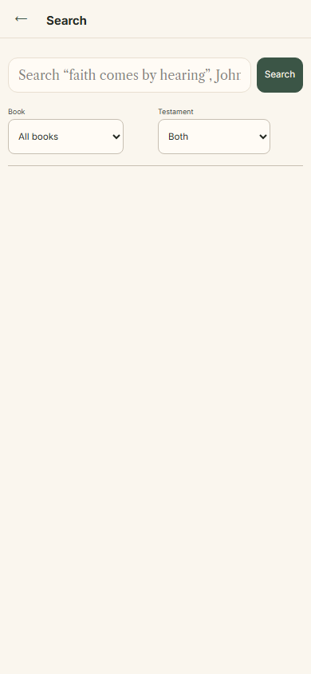
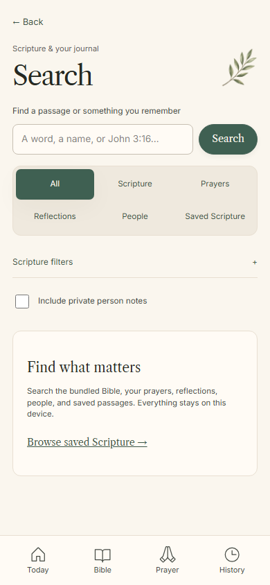
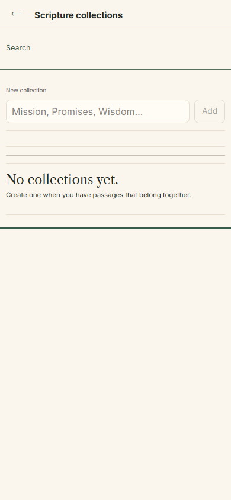
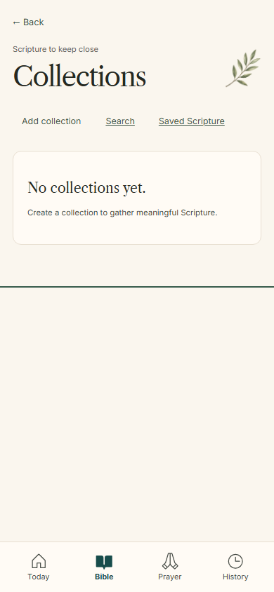

# Search & Saved Scripture — Release 2

This change stacks on the unmerged integration PR #22 (`codex/morning-grace-v2-release`). It does not merge or deploy either change. The app remains an offline, account-free journal; schema and portable backup format remain v1.

## Delivered behavior

Search has six URL-backed scopes, exact group totals, ten initial results per group in All, twenty in scoped views, and twenty more per activation. There is no former 12/30/100-result discovery cutoff. Excerpts center the match, and highlighted text uses safe React text nodes. Person notes are excluded unless explicitly enabled. Scripture failures retain usable personal results and offer a targeted retry.

Prayer updates/answers open their selected timeline entries. People open the selected directory entry. Collection notes open the exact saved item and reveal it beyond pagination. Links carry the complete originating search URL and restore revealed results, focus, and scroll. Saved reference URLs retain translation, start/end identities, and reader selection; cross-chapter ranges have an explicit continuation within the chapter reader.

`/bible/saved` gathers existing Bookmarks, Highlights, Notes, and Collections. The Bible header now opens this hub. Saved matches can also use the bundled Scripture search corpus, including reference searches, while written notes remain searchable if that optional asset fails. No new saved-passage records or tables were introduced.

Collections use requested editors, explicit note saves, revision-checked mutations, shared navigation guards, and accessible removal dialogs. Conflict comparison leaves the draft intact and requires an explicit choice before saving. Removed-target writing stays copyable; successful mutations are accepted directly rather than repeated after refresh failures. Unchanged notes/names do not increment revisions. Unsaved writing is still memory-only.

## Presentation and visual review

One `screens` composition, `src/styles/archive.css`, owns the new archive layouts. Superseded Search/Collections selectors were removed from eight legacy stylesheets. Shared typography, tokens, botanical artwork, dialogs, and navigation are reused. No artwork generation, external fonts, or runtime network service was added.

Before images come from the certified integration artifact at `81175ea1a3ae4485ba1111a24d71370113b00aa9`, served separately. After images and image baselines show the new screens. The mockup has no direct Search/Collections phone: these extend its journal family rather than claim a pixel-for-pixel composition match.

Reviewed qualities: warm paper, literary hierarchy, restrained row separators, sage semantic circles, botanical headings, forest primary actions, visible mobile navigation, and dark surfaces. Enlarged text grows naturally; decorative chevrons retain a fixed size so they cannot overflow their columns. Dedicated evening artwork and broader desktop art direction remain Release 4 work. Long collections and 200% text require natural scrolling.

| Before | After |
| --- | --- |
|  |  |
|  |  |

## Verification

The release adds readonly/pagination/context/revision tests and Chromium/Firefox/WebKit journeys, including a 10,000-request fixture. Bulk readonly reads replace per-record cursor filtering; live-record filtering and parent tombstone checks remain intact. The fixture reports synthetic insertion time separately from cold and warm search latency. Image comparisons cover 320, 360, 390, 430, 768, and 1440px; dark, enlarged text, empty/long content, expanded filters, editors, confirmations, conflicts, unavailable sources, and optional/required read failures. Database snapshots check zero writes from archive browsing/search and unchanged saves. Existing offline, backup, and devotional journeys remain required.

Final exact-commit certification results belong to the draft PR and generated `verification-summary.json`, not this source document: recording a commit hash in the commit itself would invalidate its identity. No security/backend or durable-recovery work is represented as delivered.

Next bounded release: Reading Plan and first-run experience, retaining calendar/self-paced semantics and optional enrollment.
