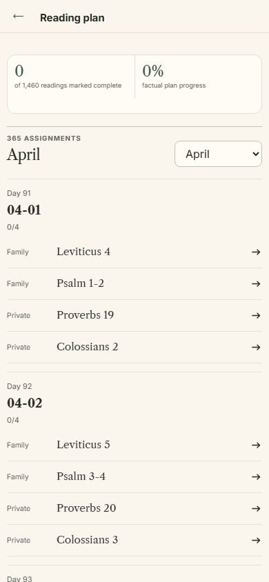
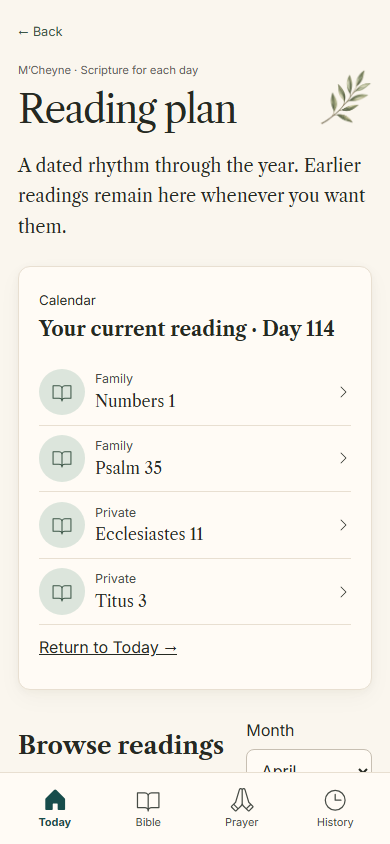
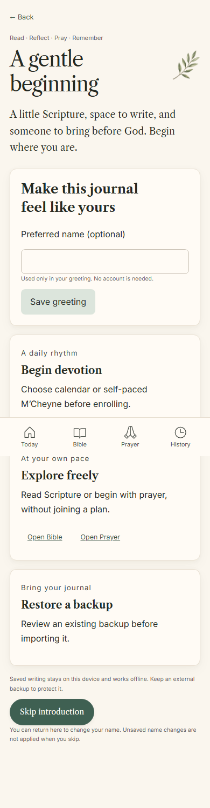

# Reading Plan & First-run Experience — Release 3

This release stacks on the open Search & Saved Scripture PR #23 (`codex/morning-grace-v2-search-saved`, verified parent `281fd9babf3adb694ad3deb0451b8b1fe1689116`). Neither release is merged or deployed here. App version remains 1.3.0; schema and portable backup format remain v1.

## Delivered behavior

Reading Plan opens as a journal: current assignment first, explicit completion indicators, literary passage rows, month browsing, and quieter progress/import explanations. Calendar and self-paced choices are explained before enrollment. Browsing does not enroll, repair active preferences, or manufacture activity. Calendar import preserves the existing semantics and creates no historical completion events. Leap day remains a pause; a new calendar year requires explicit enrollment.

`/welcome` is a short, optional introduction linked from unenrolled Today. It offers a daily plan, free Scripture/prayer exploration, and backup restoration. A locally stored optional preferred name personalizes morning, afternoon, and evening greetings. Name changes and skipping are explicit preference saves; unchanged saves write nothing. Appearance provides a link to revisit the introduction. No account or plan is required to read or pray.

The reader retains its existing typography controls, passage highlights, and explicit completion toggle. A final-passage “Mark complete and continue” action awaits the existing repository commit before returning. Full originating URLs and selected months survive bare-reader redirects and passage-segment navigation. Completion is never inferred from opening or scrolling through Scripture. Today retains its existing next-step behavior.

## Architecture and safety

A typed introduction preference uses the existing preferences table. `readPlanJournal` loads the bundled plan outside a readonly transaction and gathers enrollment/progress without repairing preferences. The compatible repository fallback retains its original default for other callers. Live reads ignore stale results and refresh on foreground, database changes, and local-date changes; greeting also responds to the hour.

Shared `PlanSetup` owns enrollment/import controls. One `screens` stylesheet, `src/styles/plan.css`, owns Plan/introduction composition and responsive rules. Superseded Plan selectors were removed from six legacy stylesheets with selector-aware parsing, preserving mixed selectors and rules belonging to other workflows. The shell uses one visible journal heading and retains the approved mobile navigation. Existing local botanical artwork is reused.

Schema, UUIDs, revisions, tombstones, calendar assignments, Scripture identity, explicit completion/prayed semantics, prayer queues, History events, and backup encryption/merge remain unchanged. Unsaved writing is still memory-only. This release adds no draft, account, sync, reminder, or native subsystem.

## Visual review

The canonical mockup contains no separate Plan or introduction phone. These screens extend the approved journal family: cream paper, Caslon/literary hierarchy, botanical headings, sage semantic circles, restrained separators, and forest actions. The current assignment replaces the earlier dashboard-like summary. Mobile artwork remains visible. At 320px and 200% text, the heading receives full width while the sprig remains beside metadata; content scrolls naturally.

Reviewed at 320, 360, 390, 430, 768, and 1440px, plus dark, enlarged text, setup/details, self-paced, optional preferences, and loading failure. Dedicated evening artwork, broader desktop composition, all remaining CSS consolidation, and human usability rounds belong to Release 4. Long month archives remain deliberately scrollable; this release does not claim a usability study or final product-wide visual certification.

| Before (certified Release 2) | After |
| --- | --- |
|  |  |

## Verification

New unit/browser checks cover preference parsing, greeting boundaries, readonly enrollment fallback, explicit preference saves and failures, optional enrollment, calendar/self-paced completion, progress import, return context, invalid-month normalization, leap day/year rollover, asset retry, unchanged saves, and zero devotional writes from browsing. Offline cold-start journeys now visit Plan and the introduction. Image comparisons cover the six required widths, dark mode, 200% text, setup/details, self-paced, errors, names, and saved preferences. Legacy fixed-morning assertions now accept the truthful time-appropriate greeting; Plan navigation checks use the journal shell.

Exact release-commit evidence, complete test counts, artifact hashes, and hosted certification belong to the draft PR and generated `verification-summary.json`. They cannot be embedded in their own source commit without changing that identity. Screenshot approval is separate from functional tests; baseline updates are limited to the new layouts and the intentional Appearance link.

Next bounded release: complete presentation/accessibility, remaining cascade cleanup, deliberate evening artwork, tablet/desktop review, usability rounds, and performance baselines. Reviewed durable-draft migration follows that release.
