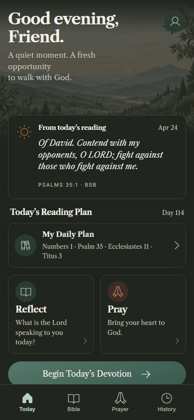
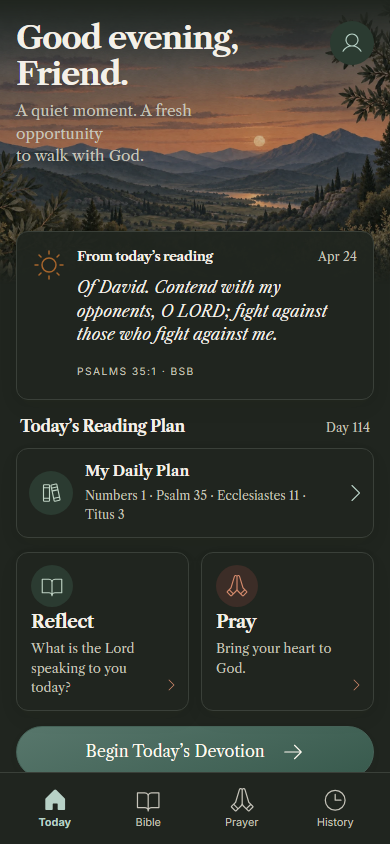
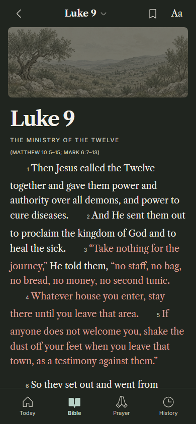
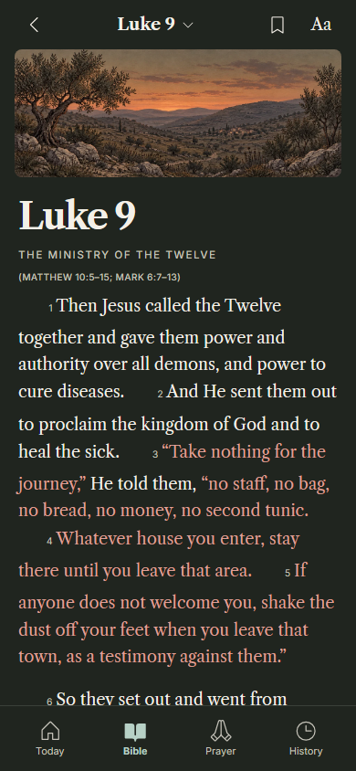
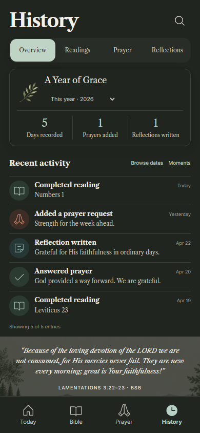
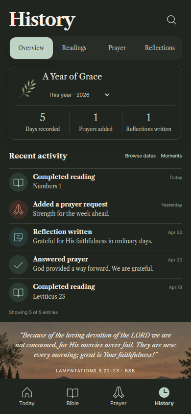

# Presentation & accessibility — Release 4

This release stacks on Reading Plan PR #24, verified parent `a88703957f94eb7755abea19d59308afa70f7d96`. It does not merge or deploy the unmerged stack. Version remains 1.3.0, schema and portable backup format remain v1.

## Delivered

The stylesheet entrypoint has no legacy, numbered-phase, or Morning Grace override imports. Seventeen obsolete stylesheets and two unused visual-demo/SVG-motif modules were removed. Shared CSS now has named owners: `base.css` for document defaults, `shell.css` for navigation, `controls.css` for controls, and `feedback.css` for loading, errors, confirmations and conflict presentation. `tokens.css` alone owns global color/font/radius/shadow tokens and shared layout aliases. Existing screen files own composition and responsive behavior. Shared cards, artwork, icons and Scripture typography retain their own component styles.

Selector-aware consolidation removed 309 obsolete selector alternatives and 149 repeated declarations, preserving conditional rule order. Unused motif tokens were removed. Root navigation rules moved out of generic components into the shell owner. Necessary reduced-motion overrides remain; ordinary navigation and draft-action specificity no longer rely on `!important`. Source contracts verify the current owners rather than requiring deleted historical overrides. Domain gates, icon provenance, Scripture checks, touch targets, and offline checks remain.

Today, Bible and History have dedicated evening landscapes derived from the approved light compositions. Their total delivered WebP size is 433,824 bytes. A shared React external-store subscription observes applied theme and OS appearance changes, including restored preferences, without reading or writing journal records. Only the chosen image is rendered; it remains decorative, responsive, locally bundled and precached. No illustration inversion, remote asset, new logo, landscape text, or photo subsystem was introduced. Botanical accents retain their existing approved transparent asset.

## Rendered review

The new evening compositions preserve the warm journal family: cream typography, olive-charcoal paper, sage identities, terracotta Scripture, and substantial natural artwork. Reviewed at 320, 360, 390, 430, 768 and 1440px, plus 200% text. Enlarged text scrolls naturally; a full-page image can show fixed navigation at its viewport position, which is not the document's bottom. History's full BSB quotation is longer than the concept's short excerpt; the band grows rather than truncating Scripture.

Existing light images remain the regression authority during consolidation. Dark baseline changes are limited to verified artwork changes; failures unrelated to those changes must be repaired rather than accepted. Exact comparison counts, inspected before/after images, commit identity and artifact hashes belong to the draft PR and generated certification evidence.

| Surface | Certified parent | Evening treatment |
|---|---|---|
| Today |  |  |
| Bible |  |  |
| History |  |  |

Before images were captured from the certified parent package, source commit `72ad181e64776ba513bb40556f965dc728958e2d`, whose tree equals the Reading Plan branch. Content and fonts were loaded before capture. Twenty-one new evening images were reviewed; the sole changed pre-existing baseline is History dark, where the formerly dim daytime band is replaced by its evening scene.

## Verification

Five new journeys run in Chromium, mobile Chromium, Firefox and WebKit: readonly system-art changes, explicit theme precedence and context returns, dark canonical contrast and 320px/200% reflow, keyboard/reduced-motion controls and failed validation, and warm reading navigation. Twenty-one additional image cases cover three evening compositions at six widths and enlarged text. Existing error/conflict/empty/long-content/editor images remain included.

Warm navigation is measured inside the browser from route initiation to the rendered chapter heading, using five samples. Attached evidence identifies engine and viewport. The existing 10,000-request search and 10,000-event History fixtures remain in certification. Local loopback measurements are supporting observations, not representative mobile-hardware certification or a reason to weaken the 200 ms / one-second targets.

No persistence, domain API, event semantics, Scripture corpus, prayer eligibility, completion rules, UUIDs, revisions, tombstones, or backup formats changed. Appearance writes remain explicit preference changes. Unsaved writing remains memory-only.

## Outstanding human gates

Automated axe, keyboard, screenshots and reflow do not certify human screen-reader use, older users' comfort, software keyboards on physical devices, or measured real-phone performance. The repeatable [usability protocol](USABILITY_REVIEW.md) is ready; participant rounds remain unperformed. This draft does not claim final product-wide visual/accessibility certification or completion of those human gates.

Next bounded engineering stage: reviewed durable-draft repository and migration specification, then device-local recovery implementation. Accounts, sync and native apps remain later releases.
